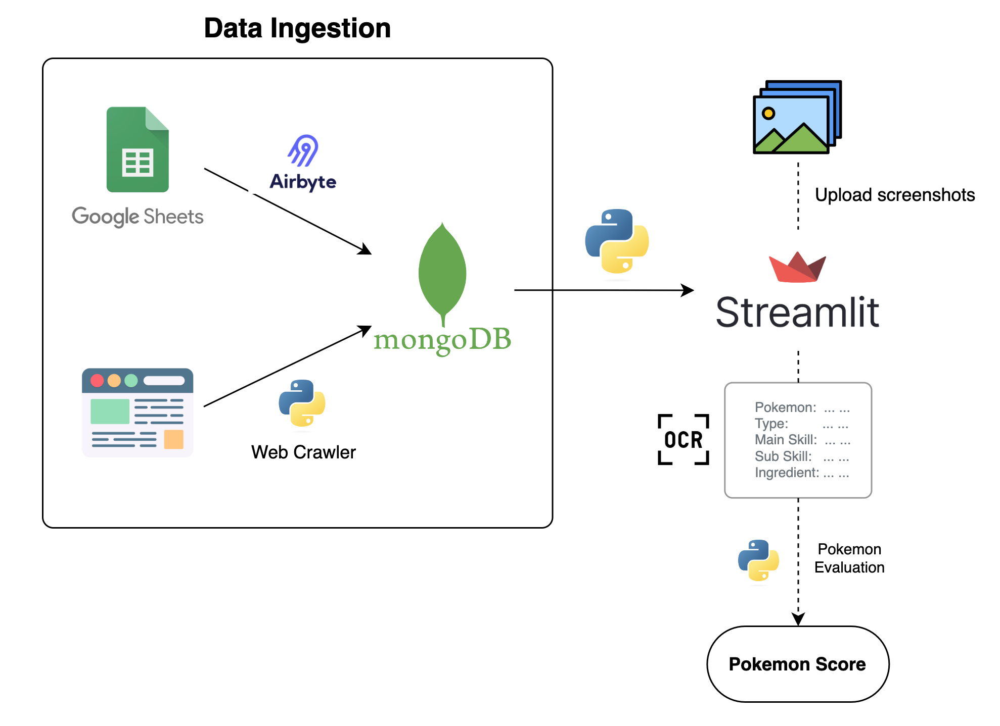
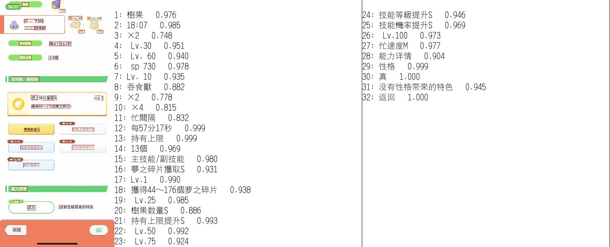
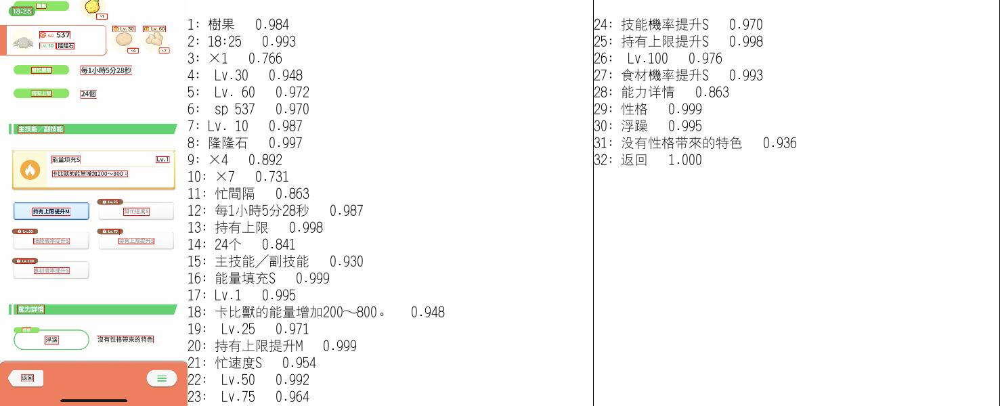
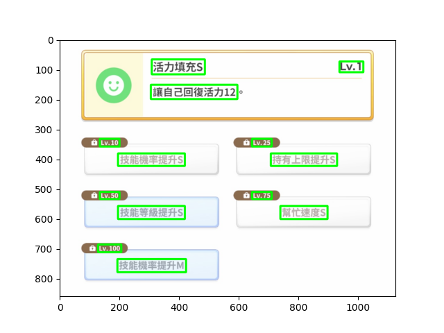

# Pokemon-Sleep Helper


## Try it
https://pokemon-sleep.streamlit.app/

## Latest Updates
- 2024/02/01 更新
  - 新增最新寶可夢，包含童偶熊、拉魯拉絲、迷你龍
  - 並且依照原計算機的調整：調降夢之碎片的能量值

## 目前功能

左側欄共有4個頁面

1. [Home](https://pokemon-sleep.streamlit.app): 首頁，點擊紅色按鈕進入不同頁面
2. [潛力計算機](https://pokemon-sleep.streamlit.app/%E6%BD%9B%E5%8A%9B%E8%A8%88%E7%AE%97%E6%A9%9F): 上傳遊戲中的寶可夢截圖，自動辨識所有文字，並可計算潛力
3. [Recipe](https://pokemon-sleep.streamlit.app/Recipe): 利用自己現有的食材篩選能做出哪些食譜料理
4. [Pokemon](https://pokemon-sleep.streamlit.app/Pokemon): 寶可夢的樹果、食材、來源島嶼

## 使用技術
- Streamlit (Front-end GUI)
- Python
  - Data process: `numpy`, `pandas`
  - Crawler: `requests`, `BeautifulSoup`, `fake_useragent`
- BigQuery (Data Warehouse)
- Airbyte (Data Extract & Load)
- Google Sheet (Raw Data)
- Docker (Container)
- Conda (Python Virtual Environment)
- VS Code (IDE)
- Text Detection (OCR 光學字元辨識)
  - `OpenCV`, `PyTesseract`, `EasyOCR`, `PaddleOCR`

## Project Flow Chart

舊版
- 

新版
- 🏗️👷 WIP

## 可能新增功能優先度
- [x] 寶可夢的產出食材頁面 (Multipage apps)
- [x] 食材圖片 (`st.column_config.ImageColumn`)
- [x] 機器學習預測樹果提供的能量（目前特徵: 寶可夢等級, 寶可夢SP）
- [x] 自動文字辨識：寶可夢截圖資訊
- [x] 藉由圖片辨識的文字來計算寶可夢能力
- [x] 新增入口首頁
- [ ] 技能文字模糊比對，提升圖片辨識的準確率（[TheFuzz](https://github.com/seatgeek/thefuzz)）

## 圖片辨識文字

- [PyTesseract](https://github.com/madmaze/pytesseract) 辨識速度快但較不準確
  - 部署需要 `packages.txt` 裡面放
    -  `tesseract-ocr`
    -  `tesseract-ocr-chi-tra`
- [EasyOCR](https://github.com/JaidedAI/EasyOCR) 辨識速度慢但感覺較準確
- [PaddleOCR](https://github.com/PaddlePaddle/PaddleOCR) 辨識速度快又準確（目前採用此套件）
  - `packages.txt`
    - `libgl1-mesa-glx`
  - 只有首次執行會較久，因為會下載和讀取 model
    ```
    download https://paddleocr.bj.bcebos.com/PP-OCRv3/multilingual/Multilingual_PP-OCRv3_det_infer.tar 
    to /home/appuser/.paddleocr/whl/det/ml/Multilingual_PP-OCRv3_det_infer/Multilingual_PP-OCRv3_det_infer.tar
    100%|██████████| 3.85M/3.85M [00:13<00:00, 287kiB/s][2023-09-02 12:58:56.839097]  

    download https://paddleocr.bj.bcebos.com/PP-OCRv3/multilingual/chinese_cht_PP-OCRv3_rec_infer.tar 
    to /home/appuser/.paddleocr/whl/rec/chinese_cht/chinese_cht_PP-OCRv3_rec_infer/chinese_cht_PP-OCRv3_rec_infer.tar
    100%|██████████| 12.3M/12.3M [00:15<00:00, 805kiB/s] [2023-09-02 12:59:13.296936] 

    download https://paddleocr.bj.bcebos.com/dygraph_v2.0/ch/ch_ppocr_mobile_v2.0_cls_infer.tar 
    to /home/appuser/.paddleocr/whl/cls/ch_ppocr_mobile_v2.0_cls_infer/ch_ppocr_mobile_v2.0_cls_infer.tar
    100%|██████████| 2.19M/2.19M [00:10<00:00, 214kiB/s][2023-09-02 12:59:26.396503]  
    ```

### 輸出結果範例

- PaddleOCR




- EasyOCR



## 資料來源

- [《野兔小幫手》v1.3.0 (Google Sheet)](https://docs.google.com/spreadsheets/d/18aAHjg762T29F74yo8axDVFO09swCa7nUp_eTZ51ZAc/edit#gid=439534137)
- [寶可夢全食譜彙整一覽表](https://pinogamer.com/16427)
- [【攻略】使用能量計算!!更科學的『寶可夢Sleep潛力計算機v4.5』五段評價系統!!](https://forum.gamer.com.tw/C.php?bsn=36685&snA=913&tnum=354)


## Note
- Streamlit Dataframe 同一個欄位的資料不能混合圖片和文字
- 使用 SHAP 要注意其他套件的版本（參考 `requirements.txt` 檔案）

